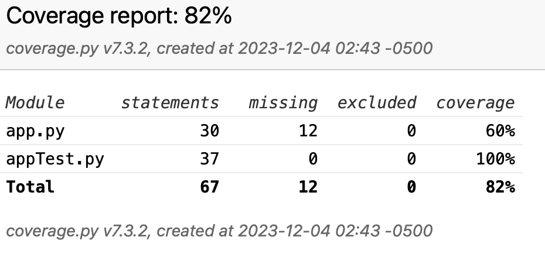

# Containerized App Exercise
# Image Recognition

[](https://github.com/software-students-fall2023/4-containerized-app-exercise-team111/actions/workflows/web-app.yml/badge.svg?event=pull_request)
[](https://github.com/software-students-fall2023/4-containerized-app-exercise-team111/actions/workflows/machine-learning-client.yml/badge.svg)

## Description

The machine learning client implemented image recognition feature, being able to identify objects within the image with a percentage match to
indicate the plausibility of matching object in the image. The web app connects to the machine client, allowing users to upload image to utilize the aforementioned picture. All data will be stored with pymongo and delievered to the users by it. 

## Team Members

- [Merlin Li](https://github.com/wwxihan2)
- [Steven](https://github.com/stevenkhl446)
- [Harley](https://github.com/harley-bulbasaur)
- [Zhiyi (Valery)](https://github.com/Val001z)

## Stand up meetings
```
Standup Report - 30 November 2023
--------------------------------

Steven Liu @stevenkhl446
- did: implemented machine learning client
-doing: test functions for mlc
-blockers none

Merlin @wwxihan2
- did: setting up web app
-doing: client side javascript for connecting to database(setting up pymongo) 
-blockers none


Standup Report - 2 December 2023
--------------------------------
Steven Liu @stevenkhl446
-did: redirect machine client learning to Merlin
-doing: test functions for updated machine client learning by Merlin
-blockers none

Merlin @wwxihan2
- did: finished web app routers structure and pymongo
-doing: client side javascript, and machine learning client 
-blockers none

Standup Report - 4 December 2023
--------------------------------
Steven Liu @stevenkhl446
- did: finsihed test functions for both web-app and machine client learning
-doing: retesting, and mongodb test functions on machine learning, other documentations 
-blockers none

Merlin @wwxihan2
- did: machine learning client, webcam.js(client side javascript), web app, mongodb.
-doing: review all documentations
-blockers none 
```


## Task boards

- [Link to task board 1](https://github.com/orgs/software-students-fall2023/projects/99)
- [Link to task board 2](https://github.com/orgs/software-students-fall2023/projects/100)


## Running the Application

- step 1: clone the repository
- step 2: run  docker-compose up --build in the main directory
- step 3: go to http://localhost:8001 on your browser
- step 4: enjoy!

## Test Coverage



